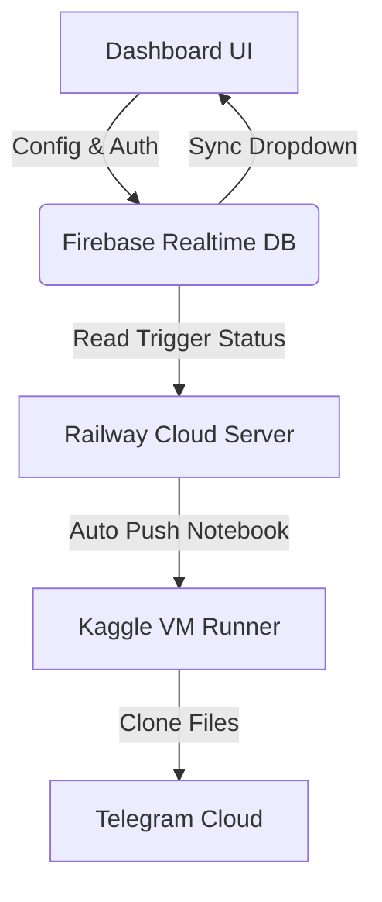

# 🛸 Telegram Cloner Ultra - Complete Setup Guide

Aapka ultimate **PC-Less (24/7 Cloud Automated) Telegram Cloner Engine** fully ready hai! Is guide ki madad se aap jab chahein naye bots add kar sakte hain aur unhe cloud restart par daal sakte hain.

---

## 🛰️ 1. Project Architecture (Kaise Kaam Karta Hai)



* **Dashboard (UI):** Link `https://restartrepo-production.up.railway.app` se aap pure system ko control karte hain (OTP login, group mapping, speed controllers, live timers).
* **Railway Cloud (Brain):** 24/7 cloud par chal raha hai. Ye Firebase se bot configuration aur restart request read karta hai aur exactly 10-minute safe shutdown wait lekar Kaggle VM restart kar deta hai.
* **Kaggle VM (Worker):** 12-hour session limits ke sath Telegram files copy/clone karta hai. Band hone se pehle restart signal trigger kar deta hai.

---

## 🛠️ 2. Naya Bot Instance Add Karne Ka Process

Agar aapko **naya, 4th bot setup** karna hai, to bas ye simple steps follow kijiye:

### Step 1: Kaggle par Naya Notebook Create karein
1. [Kaggle](https://www.kaggle.com/) open kijiye aur **`New Notebook`** create kijiye.
2. Us notebook ka **URL/Slug** copy kar lijiye (e.g., `alien-bot-3` ya `cloner-v7`).

### Step 2: Dashboard par Bot Register karein
1. Railway Dashboard open kijiye.
2. Header me green color ke **`+ Add`** button par click kijiye.
3. Form me ye details fill kijiye:
   * **Bot Label/Name:** Koi bhi pyara sa naam (e.g., `AL!EN 3.0 🪐`)
   * **Firebase Root Node:** Naya unique root node name (e.g., `cloner_v7_mapping`)
   * **Firebase Database URL:** Aapka Firebase RTDB link.
4. **OK** click kar dijiye. *(Ye instantly Firebase database aur aapke sabhi devices me sync ho jayega!)*

### Step 3: Configurations Setup karein
1. Dropdown switcher se naye bot (`AL!EN 3.0 🪐`) ko select kijiye.
2. Dashboard par left-side forms me details enter kijiye:
   * **Telegram Settings:** API ID, API Hash, Bot Token, Owner Chat ID.
   * **Kaggle Settings:**
     * Username: `pankajmourrya`
     * Key: `581360a6a230292364e96a0ec8db406c`
     * Slug: Step 1 me jo Kaggle notebook slug copy kiya tha.
3. **Save Config / Connect** par click kijiye.

### Step 4: OTP Verification (Session String)
1. Telegram Section me apna phone number fill kijiye aur **Send OTP** click kijiye.
2. OTP (aur password agar 2FA on hai) enter karke **Verify OTP** kijiye.
3. Naya session string automatic banega aur Firebase config me save ho jayega.

### Step 5: Cloning Start karein!
1. Dashboard par source group scan karke topics check kijiye.
2. **Start Cloning** click kijiye. 
3. Aapka bot cloud automation list me register ho chuka hai aur 24/7 self-restart hota rahega!

---

## 💡 Important Tips & Maintenance

> [!TIP]
> **No Local Server Needed:**
> Ek baar Telegram login aur configuration complete ho jaye, to aap **`server.py` ko local PC par band kar sakte hain aur PC shutdown kar sakte hain!** Railway cloud server pure auto-restart system ko akele handle karega.

> [!IMPORTANT]
> **10-Minute Delay Rule:**
> Jab bhi koi bot 11.5 hours baad stop hota hai, to cloud server use instantly restart nahi karta. Wo **exactly 10 minute (600s) sleep stage** me jata hai taaki purana Kaggle VM release ho jaye aur session conflict errors na aayein.

---

## ⚡ Developer Git Commands (For Code Updates)

Agar aapko code files (`cells/cellX.py`) me koi badlav karna ho, to apne terminal me ye commands run karein:

```powershell
# Changes stage karein
git add .

# Changes commit karein
git commit -m "Updated cloner cells logic"

# Push to GitHub (Railway will automatically auto-deploy in 30s)
git push
```
